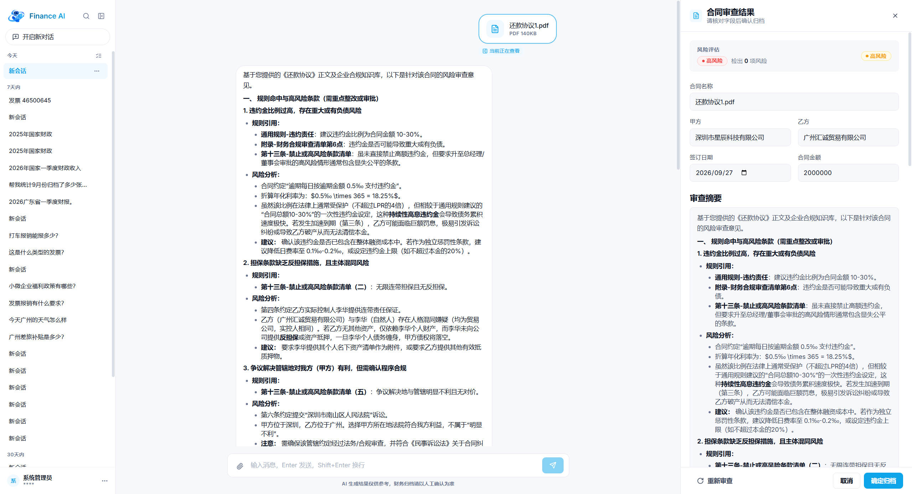
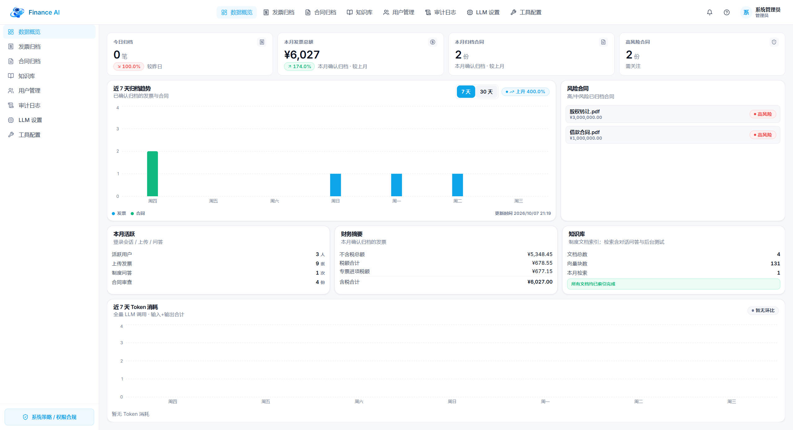
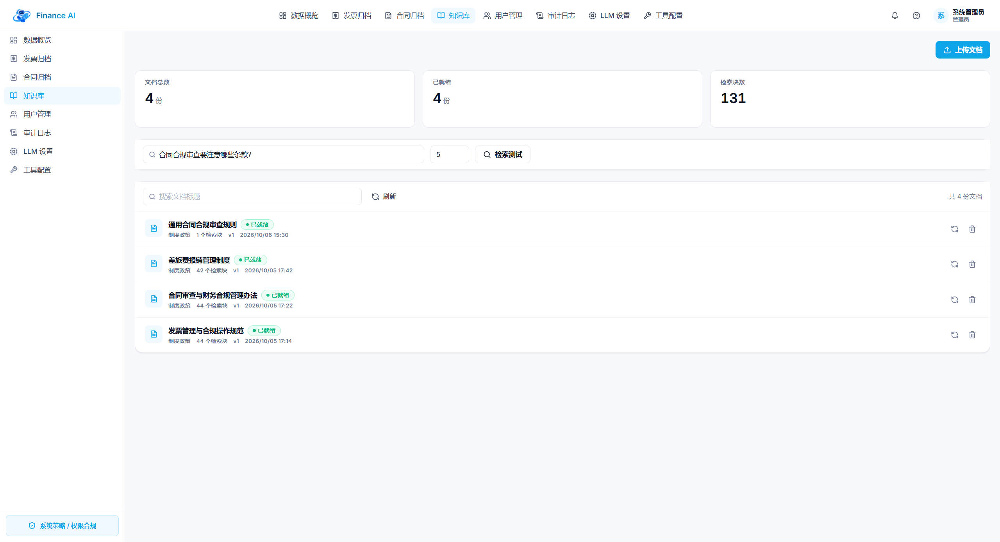
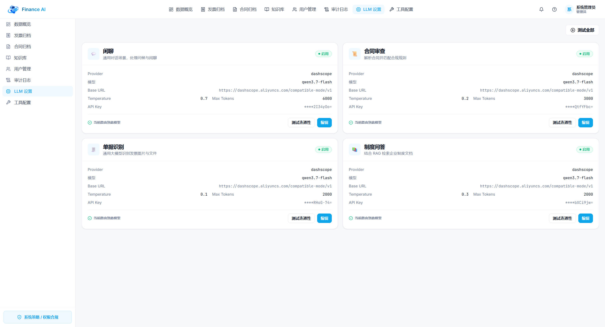
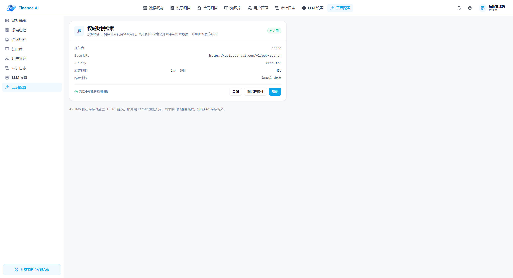
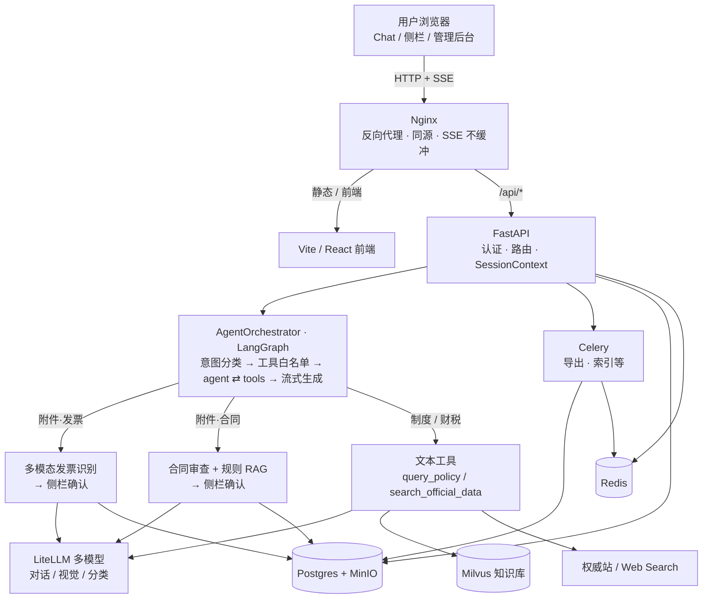
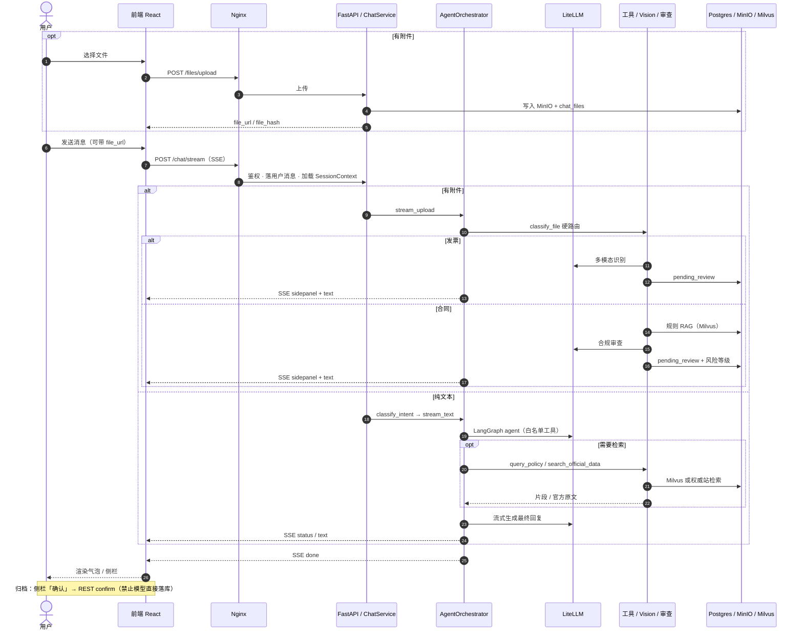

<div align="center">

**Finance AI · 企业财务 AI Agent 平台**

# 以对话为入口的企业财务智能体

从发票识别、合同审查、知识入库到制度问答、工具调用与运营后台的完整闭环

[](https://github.com/UnicornHang/finance)
[](./backend)
[](./frontend)
[](./docs/agent-langchain-langgraph.md)
[](./docs)
[](./frontend)
[](./docker-compose.yml)

[项目截图](#项目截图) · [核心能力](#核心能力) · [整体架构](#整体架构) · [快速开始](#快速开始) · [文档导航](#文档导航)

开源不易，如果这个项目对你有帮助，欢迎给 **Finance AI** 点一个 Star ⭐

</div>

## Finance AI 是什么？

Finance AI 是一套以对话为入口的企业财务 AI Agent 平台：员工在 Chat 中上传发票与合同，即可完成多模态识别、合规审查与侧栏确认归档；管理员可维护知识库、配置 LLM 场景与工具，并通过看板、档案与审计日志运营全链路。

系统覆盖「输入 → 意图分流 → 检索 / 识别 → 流式生成 → 人工确认 → 归档」的工程闭环：文本路径由 LangGraph 按意图白名单调度 `query_policy`、`search_official_data` 等工具；附件路径硬路由至发票视觉识别或合同规则 RAG 审查。MVP 主链路已基本落地，配置好各场景 API Key 后即可一键本地部署体验。

## 项目截图

| 登录页 | 对话 · 合同审查 |
|:---:|:---:|
|  |  |

| 数据概览 | 知识库 |
|:---:|:---:|
|  |  |

| LLM 设置 | 工具配置 |
|:---:|:---:|
|  |  |

## 核心能力

- 🧾 **发票智能识别**：对话内上传 → 多模态大模型同步识别 → 侧栏确认 → 归档（去重与行级权限）
- 📜 **合同合规审查**：解析 + 规则 RAG，风险等级入库与合同档案管理
- 💬 **制度问答 / Agent**：LangGraph 编排；企业知识库检索 + 公开财税权威检索，回答带来源
- 📚 **RAG 知识库**：文档上传、切分策略、Milvus 向量化、试检索与重建索引
- 🧠 **会话上下文**：完整历史 + 摘要折叠 + 结构化记忆，长会话可召回关键实体
- 🗂️ **管理后台**：看板、发票/合同档案、用户与角色、LLM 场景配置、工具开关、审计日志、异步导出
- 🔒 **多租户就绪**：`tenant_id` + 行级过滤；私有化单机部署，可演进 SaaS
- 🐳 **一键部署**：Docker Compose 拉起前后端、Worker、DB、Redis、MinIO、Milvus、Nginx

## 技术栈

| 层 | 技术 |
|---|---|
| 前端 | React 18 + TypeScript + shadcn/ui + TailwindCSS + Vite + Zustand |
| 后端 | Python 3.11 + FastAPI + SQLAlchemy 2.0 + Celery |
| Agent | LangChain / LangGraph + LiteLLM（多模型可配置） |
| 数据 | PostgreSQL 16 + Redis + MinIO |
| 向量 | Milvus（知识库主路径） |
| 部署 | Docker Compose + Nginx（可选 Prometheus / Grafana） |

## 整体架构

对话入口经 Nginx 同源反代；流式用 **SSE**（非 WebSocket）。文本走 LangGraph 工具循环；附件走硬路由识别/审查，归档须人工确认。



## 请求流程

以对话主路径为例：先可选上传落 MinIO，再 `POST /api/v1/chat/stream` 开 SSE；有附件硬路由识别/审查并推侧栏，无附件则意图分类后进 LangGraph。



**SSE 事件类型**：`status`（进度）· `text`（增量正文）· `sidepanel`（发票/合同侧栏）· `done` / `error`。

## 仓库结构

```
finance/
├── backend/                      # FastAPI 后端
│   ├── app/
│   │   ├── api/v1/               # HTTP 路由（auth/chat/invoices/contracts/kb/…）
│   │   ├── agent/                # LangGraph 编排、工具、会话记忆
│   │   ├── services/             # 业务服务（识别、审查、RAG、导出等）
│   │   ├── models/ · schemas/    # ORM 与 Pydantic
│   │   ├── tasks/                # Celery 异步任务
│   │   ├── chunking/             # 知识库切分策略
│   │   └── core/                 # 安全、中间件等公共能力
│   ├── alembic/                  # 数据库迁移
│   ├── tests/                    # 后端测试
│   ├── scripts/                  # seed 等后端脚本
│   ├── Dockerfile
│   └── pyproject.toml
├── frontend/                     # React 前端（对话端 + 管理后台）
│   └── src/
│       ├── pages/                # 登录、Chat、管理壳等页面
│       ├── components/
│       │   ├── chat/             # 会话列表、输入框、流式渲染
│       │   ├── sidepanel/        # 发票/合同侧栏
│       │   ├── admin/            # 看板、档案、知识库、LLM、导出等
│       │   └── ui/               # shadcn 基础组件
│       ├── api/                  # 前端 API 客户端
│       ├── hooks/ · stores/      # SSE、会话状态等
│       └── types/                # 共享 TypeScript 类型
├── nginx/                        # 反向代理与可选监控配置
│   ├── nginx.conf
│   └── prometheus.yml
├── db/
│   └── init.sql                  # Postgres 初始化
├── scripts/
│   ├── setup.sh / setup.ps1      # 一键启动（含 seed）
│   ├── smoke.sh                  # 端到端烟测
│   └── deploy-vm.sh              # 虚拟机部署
├── docs/
│   ├── PRD.md · TD.md            # 产品与技术方案
│   ├── agent-langchain-langgraph.md
│   └── superpowers/              # specs（设计）+ plans（实现计划）
├── images/                       # README 截图
├── docker-compose.yml            # 全套服务一键启动
├── docker-compose.infra.yml      # 仅基础设施（本机拆分开发）
├── .env.example                  # 环境变量模板
└── AGENT.md                      # 工程规约（给协作者 / Agent）
```

## 快速开始

### 前置条件

- Docker 24+ / Docker Compose v2
- 8GB+ 可用内存（含 Milvus 建议更充裕）
- 磁盘按数据量预留（演示环境数十 GB 即可）

### 一键启动（推荐）

```bash
# Git Bash / WSL / macOS / Linux
./scripts/setup.sh

# Windows PowerShell
.\scripts\setup.ps1
```

脚本会：复制 `.env`（若不存在）→ 构建并启动服务 → 等待健康检查 → 迁移与 seed。

> 重置环境（删除 volumes 重来）：`./scripts/setup.sh --reset` 或 `.\scripts\setup.ps1 -Reset`

启动后请编辑根目录 `.env`，填入各场景 LLM API Key（及可选的联网搜索相关配置），否则对话与识别会因缺凭证失败。

### 访问地址

| 地址 | 用途 |
|---|---|
| http://localhost | **推荐入口**（nginx：前端 + API 同源） |
| http://localhost:5173 | 前端直连（调试用） |
| http://localhost/docs | Swagger API 文档 |
| http://localhost:9001 | MinIO 控制台 |

### 端到端烟测

```bash
./scripts/smoke.sh
```

覆盖健康检查、登录、会话、SSE、LLM 配置、发票上传确认等主路径。

### 手动分步启动

```bash
cp .env.example .env
# 编辑 JWT_SECRET、各场景 API Key 等

docker compose up -d --build
docker compose logs -f backend
```

### 默认账号

| 账号 | 密码 | 角色 |
|---|---|---|
| admin | Admin@123 | 管理员 |
| finance01 | Finance@123 | 财务 |
| employee01 | Emp@123 | 员工 |

> 首次登录强制修改密码。

### 本地开发（无全套 Docker）

可仅用 `docker compose -f docker-compose.infra.yml up -d` 起基础设施，再本机跑前后端：

```bash
# 后端
cd backend
python -m venv .venv
source .venv/bin/activate   # Windows: .venv\Scripts\activate
pip install -e ".[dev]"
uvicorn app.main:app --reload --port 8000

# 前端
cd frontend
npm install
npm run dev
```

## 文档导航

- [PRD 产品需求文档](docs/PRD.md)
- [TD 技术选型与架构设计](docs/TD.md)
- [Agent / LangGraph 说明](docs/agent-langchain-langgraph.md)

> 虚拟机部署可用 `scripts/deploy-vm.sh`

### 后续方向

- 运维与私有化：场景 Key 管理、部署手册与监控告警打磨
- 工程补强：流式真正可中断、清理历史 OCR 异步残留、稀疏检索等
- 产品演进：合规规则库运营、权限与看板深化、多租户 SaaS

## License

MIT License — 可自由使用、修改与分发。若基于本项目做出了有意思的东西，欢迎提 PR 😄

如果这个项目对你有帮助，请给仓库点一个 **Star** ⭐，这是对维护者最大的鼓励：

**[https://github.com/UnicornHang/finance](https://github.com/UnicornHang/finance)**

## 开源协议与引用规范

本项目以开源方式持续演进，欢迎学习、参考，以及基于本项目搭建商业化产品。若你在公开技术分享、衍生开源项目或商业发行版中使用了本项目的代码或架构设计，请注明原项目出处：

```text
Based on Finance AI Agent:
https://github.com/UnicornHang/finance
```
