# RAG 知识库详细设计文档

| 项 | 内容 |
|---|---|
| 文档版本 | v1.2 |
| 适用系统 | Finance AI Agent（企业财务 AI 平台） |
| 关联文档 | [PRD.md](./PRD.md)、[TD.md](./TD.md)、[backend-runbook.md](./backend-runbook.md) |
| 状态 | **向量主存 Milvus**；Chat 制度问答已接 RAG；Rerank 仍为演进项 |
| 变更摘要 | v1.2：默认 Embedding `qwen3.7-text-embedding`；Chat `policy_query` 注入知识库；v1.1：Milvus |

---

## 1. 背景与目标

### 1.1 要解决什么问题

财务场景里有两类「必须有依据」的智能能力：

1. **制度问答**：报销标准、差旅补贴、审批流程等，回答必须能追溯到制度原文。
2. **合同合规审查**：盖章、付款周期、违约、争议解决等规则应可维护、可演进，而不是写死在 Prompt 或代码常量里。

若规则硬编码：

- 改一条规则就要发版；
- 多租户差异无法隔离；
- 无法向用户展示「依据哪份文档」。

因此采用 **RAG（Retrieval-Augmented Generation）**：先检索再生成。

### 1.2 设计目标

| 目标 | 说明 |
|---|---|
| 可维护 | 管理员上传/删除/重索引即可更新知识，无需改代码 |
| 可追溯 | 召回片段带文档标题、类型、分数，回答可附来源 |
| 多租户友好 | `tenant_id = NULL` 为通用规则；租户文档仅本租户可见 |
| 企业级向量检索 | **Milvus** 作为专用向量库，支撑规模化 ANN、独立扩缩与运维 |
| 职责分离 | Postgres 管事务/元数据/正文；Milvus 管向量；失败可降级（可选 PG 备份向量） |
| 渐进演进 | 先保证「能索引、能召回、能注入」；混合检索增强与 Rerank 可后续叠加 |

### 1.3 非目标（当前阶段不做）

- 会话历史消息的超长期 RAG（`message_embeddings` 表已预留，链路未做）
- 多模态知识库（图片/扫描件 OCR 入库）作为主路径
- 面向公网的开放检索 API
- 自动从互联网抓取法规更新

---

## 2. 系统上下文

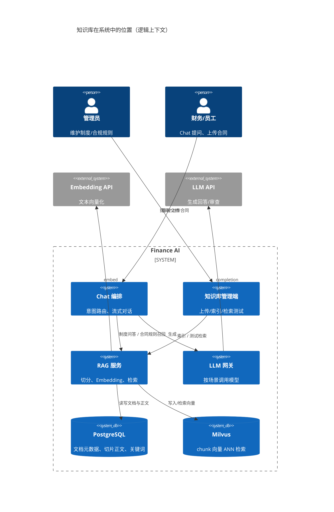

### 2.1 与产品原则的对齐

PRD「规则即知识，可演进」：

> 合同合规规则以 RAG 文档形式维护，通用规则是默认文档，租户自定义规则是额外文档。

本设计把「规则」与「制度」统一建模为 `kb_documents`，用 `doc_type` 区分（`rule` / `policy` / `template` 等），检索侧按类型过滤即可复用同一套管道。

---

## 3. 总体架构

### 3.1 逻辑分层

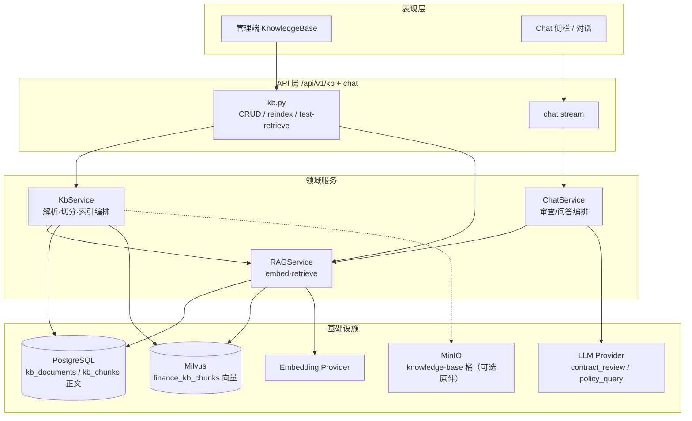

### 3.2 核心模块职责

| 模块 | 职责 | 不负责 |
|---|---|---|
| `KbService` | 文件解析、切分、索引事务、文档生命周期 | 生成自然语言答案 |
| `RAGService` | Embedding、向量/关键词检索、规则专用入口 | 文档 CRUD UI 逻辑 |
| `ChatService` | 把召回结果注入 Prompt，驱动审查/问答 | 知识库管理权限细节 |
| 管理端 UI | 上传、列表、重索引、删除、检索测试 | 直接调 Embedding |

### 3.3 为什么采用 Milvus（企业级主选型）

本项目定位为**企业级 Agent**：知识库会随制度版本、多租户规则、合同模板持续膨胀，向量检索是核心基础设施，不应长期绑在 OLTP 库上。

| 维度 | **Milvus（选用）** | pgvector（降级/备份） | Qdrant |
|---|---|---|---|
| 定位 | 专业向量数据库，ANN/索引/扩缩成熟 | PG 扩展，适合轻量 | 专业向量库，运维模型不同 |
| 性能与规模 | IVF / HNSW、独立扩容，适合企业增长 | 与业务库争抢 IO/CPU | 优秀，生态略异 |
| 过滤 | 标量过滤 `tenant_id` / `doc_type` | SQL WHERE 强 | Payload filter |
| 一致性 | 应用层：先写 PG 正文再写向量；删文档双删 | 同事务更易 | 同左 |
| 运维 | Compose Standalone 可落地；生产可上集群 | 运维少 | 需单独规划 |
| 与本仓契合 | 已接入 `pymilvus` + `finance_kb_chunks` | 列可空，可选 `KB_STORE_PG_EMBEDDING` | 未选 |

**结论（v1.1）**：

- **主路径**：Embedding → **Milvus** ANN → 用 `chunk_id` 回表 Postgres 正文。
- **Postgres**：权威存放 `kb_documents` / `kb_chunks.content` / 状态；`embedding` 列可空。
- **降级**：Milvus 故障时，若开启了 PG 向量备份则回退 pgvector；否则检索报错/审查跳过规则（可用性策略不变）。

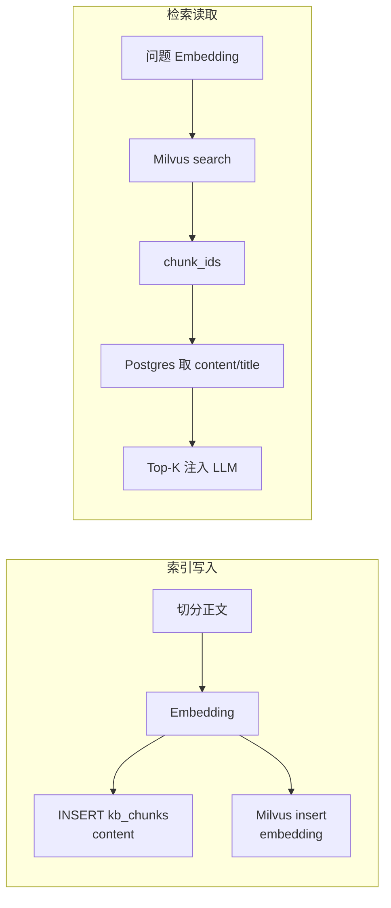

---

## 4. 领域模型与数据设计

### 4.1 概念模型

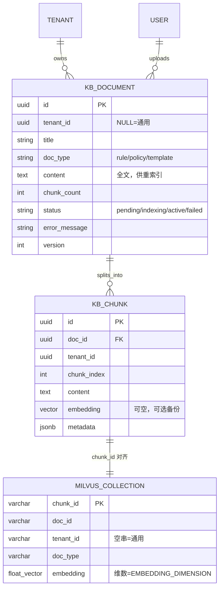

### 4.2 状态机

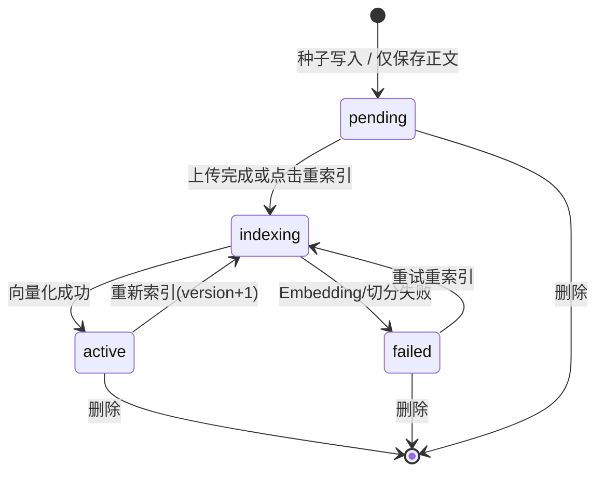

**为什么保留全文 `content`**：重索引不必重新上传；Embedding 模型升级时可批量 `reindex`。代价是库体积增大，可用对象存储存原件、库内只留纯文本（演进项）。

### 4.3 租户可见性规则

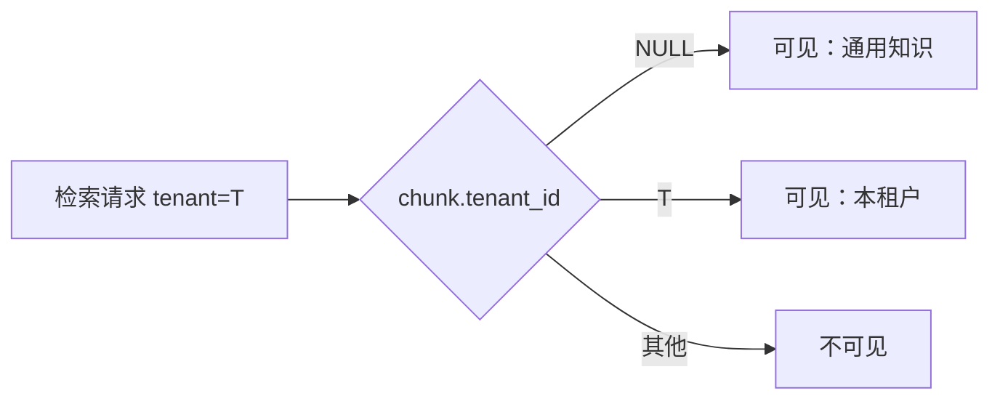

SQL 语义：

```sql
WHERE d.status = 'active'
  AND (c.tenant_id = :tenant OR c.tenant_id IS NULL)
```

**为什么通用文档用 `NULL` 而不是魔法 UUID**：与 PRD/TD 一致，语义清晰；索引与查询条件简单。注意：管理员删除通用文档会影响全平台，UI 应提示。

### 4.4 文档类型约定

| doc_type | 用途 | 主消费方 |
|---|---|---|
| `rule` | 合同合规规则 | `retrieve_rules` → 合同审查 |
| `policy` | 报销/差旅等制度 | 制度问答（规划） |
| `template` | 合同模板说明 | 问答 / 辅助起草（规划） |
| 其他/空 | 通用 | 宽检索 |

---

## 5. 索引管道（Indexing Pipeline）

### 5.1 端到端流程

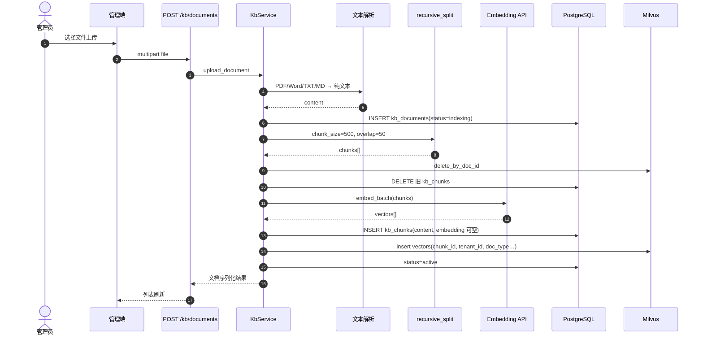

### 5.2 切分策略

采用 **递归字符切分（段落优先）**：

1. 按空行分段；
2. 不足再按单行、句号切；
3. 单段过长则硬切；
4. 默认 `chunk_size=500`，`overlap=50`（与 TD §9.2 一致）。

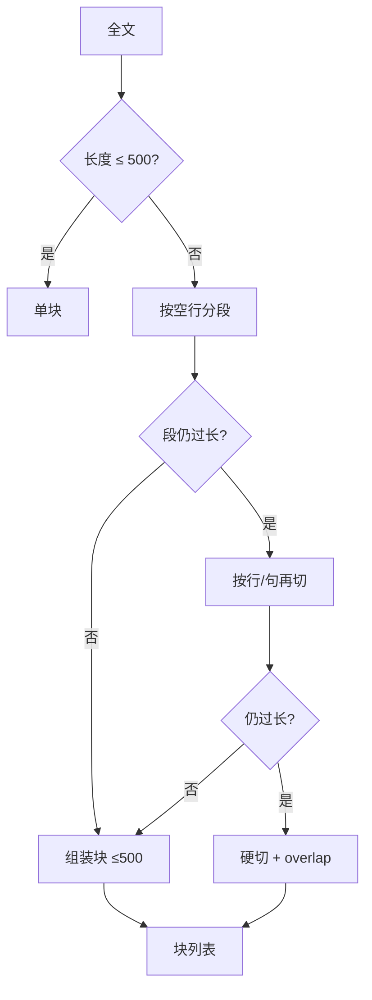

#### 为什么这样切，而不是别的？

| 方案 | 优点 | 缺点 | 是否采用 |
|---|---|---|---|
| 固定长度硬切 | 实现极简 | 切断条款编号与标题语义 | 仅作超长段落兜底 |
| 段落递归切（当前） | 实现简单、中文制度友好、可控 | 非语义边界时仍可能割裂 | **MVP 采用** |
| 语义切分（embedding 聚类） | 边界更合理 | 成本高、难调、延迟大 | 后续可选 |
| 按 Markdown 标题树切 | 结构清晰 | 依赖排版质量 | 对 MD 源可增强 |

### 5.3 解析策略

| 格式 | 策略 |
|---|---|
| `.txt` / `.md` | UTF-8 / GB18030 解码 |
| `.pdf` | 复用合同链路的 PDF 文本抽取（pypdf / pypdfium2） |
| `.docx` / `.doc` | 复用 Word 抽取逻辑 |

**为什么复用 `invoice_document` 抽取**：避免两套 PDF 解析分叉；合同与知识库对「可读正文」要求一致。

### 5.4 同步索引 vs 异步任务

| 模式 | 优点 | 缺点 | 决策 |
|---|---|---|---|
| 请求内同步索引（当前 MVP） | 实现简单、状态立即可见、易排查 | 大文件可能拖长请求 | **小文档 MVP 采用** |
| Celery 异步 | 适配大文件、可重试 | 需 worker、状态轮询、失败可见性 | 单文件 >2～3 万字或超时频发时升级 |

当前限制：单文件 ≤ 8MB，正文过短（<20 字）拒绝入库。

---

## 6. 检索管道（Retrieval Pipeline）

### 6.1 目标流程（完整版，含 Rerank）

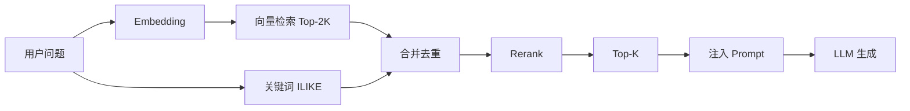

### 6.2 当前已实现流程（Milvus 主路径）

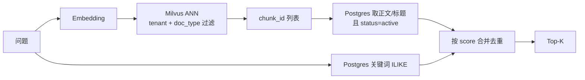

说明：

- **已做**：Milvus 向量召回、标量过滤、关键词补充、回表正文、管理端检索测试、合同规则注入。
- **未做**：独立 Rerank、BM25 倒排、查询改写（HyDE）。
- **降级**：Milvus 异常时尝试 pgvector（需 `KB_STORE_PG_EMBEDDING=true` 且列有值）。

### 6.3 分数与合并策略

1. 向量分：Milvus `COSINE` 下 `score` 直接取返回的相似度（越大越相关；勿做 `1 - distance`）。
2. 仅关键词命中：赋予基准分（如 0.5）。
3. 两边都命中：标记 `source=hybrid`，取较高分。
4. 最终按 `score` 降序截断 Top-K。

### 6.3.1 Collection 设计

| 字段 | 类型 | 说明 |
|---|---|---|
| `chunk_id` | VarChar(36) PK | 与 `kb_chunks.id` 一致 |
| `doc_id` | VarChar(36) | 删除/重索引按文档清理 |
| `tenant_id` | VarChar(36) | 空串 = 通用文档 |
| `doc_type` | VarChar(64) | `rule` / `policy` 等 |
| `embedding` | FloatVector(dim) | 默认 **1024**（随 `EMBEDDING_DIMENSION`），COSINE + IVF_FLAT |

过滤示例：`(tenant_id == "{tid}" or tenant_id == "") and doc_type == "rule"`。

### 6.4 专用入口：`retrieve_rules`

合同审查并不直接把用户问题当 query，而是使用稳定查询意图，例如：

> 「合同合规审查规则 盖章 付款 违约 争议解决」

并优先 `doc_type=rule`；若无结果再放宽到全部类型。

**为什么用固定 query 而不是合同全文做检索**：

- 合同全文极长，直接 embed 成本高且噪声大；
- 规则库是「检查清单」，应用「规则侧检索」比「合同侧检索」更稳；
- 后续可演进为：规则清单固定召回 + 合同条款局部检索（条款级 RAG）。

### 6.5 注入合同审查的方式

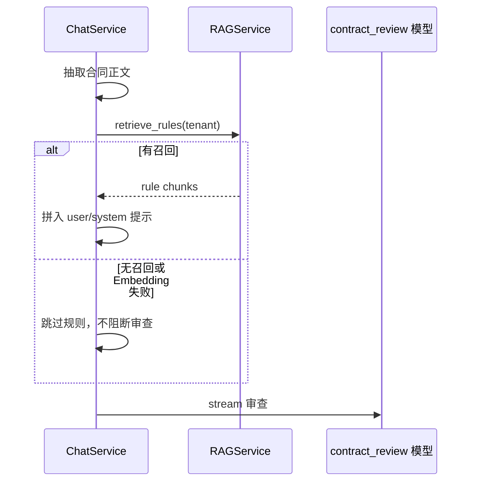

**降级原则**：知识库不可用时，审查仍可进行（退化为纯模型判断），并在日志中记录 `RAG rules skipped`。产品上应逐步引导管理员完成种子文档索引。

---

## 7. 业务场景接入设计

### 7.1 场景总览

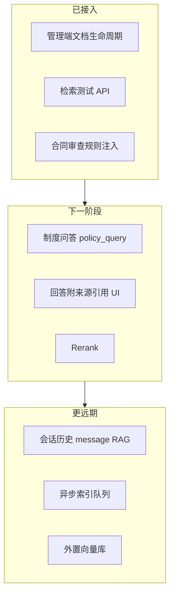

### 7.2 制度问答（目标设计）

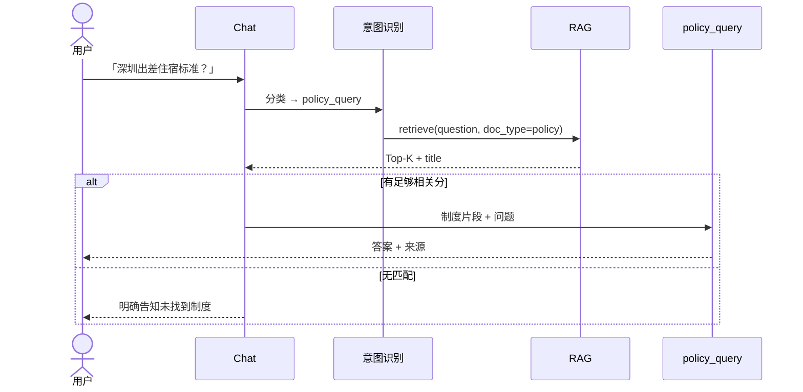

回答契约（建议）：

- 必含：结论、适用条件、来源文档名；
- 禁止：编造未召回到的数字标准；
- 低分召回：提示「依据不充分」。

### 7.3 与「四层上下文」的关系

PRD 上下文策略：

| 层 | 机制 | 与知识库关系 |
|---|---|---|
| 短期 | 当前会话完整消息 | 无关 |
| 中期 | 摘要 | 无关 |
| 长期 | 结构化实体记忆 | 无关 |
| 超长期 | 历史消息向量检索 | **另一套 RAG**（`message_embeddings`），勿与制度库混用 |

制度/规则知识库解决的是 **组织知识**；会话历史 RAG 解决的是 **个人对话记忆**。索引、权限、生命周期必须分开。

---

## 8. API 与权限设计

### 8.1 管理 API

| 方法 | 路径 | 说明 |
|---|---|---|
| GET | `/api/v1/kb/documents` | 列表（租户 + 通用） |
| POST | `/api/v1/kb/documents` | 上传并索引（multipart） |
| DELETE | `/api/v1/kb/documents/{id}` | 删除（级联 chunks） |
| POST | `/api/v1/kb/documents/{id}/reindex` | 重索引 |
| POST | `/api/v1/kb/test-retrieve` | 检索测试 |

### 8.2 权限

| 操作 | 角色 |
|---|---|
| 管理知识库 / 检索测试 | `admin` |
| Chat 中间接使用召回结果 | 登录用户（由 Chat 编排，不直接暴露 KB 写接口） |

**为什么管理写操作仅 admin**：知识库影响全租户（甚至通用规则影响全平台）合规结论，属于高风险配置面。

---

## 9. Embedding 与模型选型

### 9.1 当前配置

| 项 | 默认 | 说明 |
|---|---|---|
| Model | `qwen3.7-text-embedding` | 通义最新文本向量；经 DashScope OpenAI 兼容网关 |
| 维度 | **1024**（默认） | 官方可选 2560 / 2048 / 1536 / 1024 / 768 / 512 / 256；须与 Milvus collection 同维 |
| Base URL | `https://dashscope.aliyuncs.com/compatible-mode/v1` | 国内网络友好 |
| Key | `EMBEDDING_API_KEY`；可回落 `LLM_*_API_KEY` / 管理端 `llm_configs`（同租户启用密钥） | 本地未配独立 Embedding Key 也能跑通 |

### 9.2 替代方案对比

| 方案 | 优点 | 缺点 | 适用 |
|---|---|---|---|
| **qwen3.7-text-embedding（当前）** | 中英检索强、国内可达、维数可调 | 依赖百炼账号与配额 | 国内云 / 当前默认 |
| text-embedding-v3 / v4 | 成熟稳定 | 中文检索弱于 qwen3.7 | 已有通义旧链路 |
| text-embedding-3-small（OpenAI） | 易接入、生态好 | 数据出域、国内网络 | 已有 OpenAI 兼容网关 |
| bge-m3 / bge-large-zh（本地） | 可私有化 | 需 GPU/服务化、维数变更要迁库 | 强合规私有化 |

**换模型注意**：

- 模型或维度变更后，旧向量不可复用，须 **drop/重建同维 Milvus collection**（若 dim 变了）并 **全量 reindex**；
- `kb_documents.embedding_model` 记录所用模型名，便于检测不一致；
- 通义单次批量上限：qwen3.7 为 20 条，v3/v4 为 10 条（实现已按模型限流）。

---

## 10. 关键设计决策与替代方案汇总

### 10.1 决策记录（ADR 风格）

#### ADR-1：向量主库存放在 Milvus（v1.1 决策）

- **决策**：**采用 Milvus** 作为企业级向量主存；Postgres 保留正文与元数据。
- **原因**：企业 Agent 需独立扩缩与专业 ANN；避免向量检索拖垮 OLTP；支持租户/类型标量过滤。
- **替代**：纯 pgvector（已降为可选备份）；Qdrant/Weaviate（未选，优先生态与 Compose 落地成熟度）。
- **一致性**：索引时先删 Milvus 旧向量 → 写 PG chunks → 写 Milvus；删除文档双删。
- **何时再评估**：若改为全托管云向量服务（如 Zilliz Cloud），可只换连接层，Collection schema 保持不变。

#### ADR-2：规则与制度同一套文档模型

- **决策**：同一 `kb_documents`，用 `doc_type` 区分。
- **原因**：管道复用；管理端统一；租户隔离模型一致。
- **替代**：规则引擎（Drools）+ 制度库分离。
- **为何不选规则引擎**：财务制度以自然语言为主，变更频繁，专家规则维护成本更高。

#### ADR-3：MVP 同步索引

- **决策**：上传请求内完成向量化。
- **原因**：闭环快、易演示、失败立刻可见。
- **替代**：Celery 异步。
- **推翻条件**：超时/大文件成为主诉。

#### ADR-4：审查链路 RAG 失败不阻断

- **决策**：召回失败则跳过规则注入。
- **原因**：可用性优先；避免 Embedding 故障导致合同审查全站不可用。
- **替代**：强依赖（无规则拒绝审查）。
- **风险**：管理员可能误以为「已按制度审查」。缓解：管理端展示索引状态；审查文案区分「规则命中 / 一般建议」。

#### ADR-5：通用知识 `tenant_id IS NULL`

- **决策**：采用。
- **替代**：平台租户复制一份规则到每个租户。
- **为何不复制**：升级通用规则需刷全部租户；NULL 共享更符合「平台默认 + 租户覆盖」模型。

### 10.2 检索算法替代

| 方案 | 召回 | 精度 | 成本 | 现状 |
|---|---|---|---|---|
| 纯向量 | 中 | 中 | 中 | 已做主干 |
| 向量 + 关键词（当前） | 高 | 中 | 中 | **已做** |
| + Rerank | 高 | 高 | 较高 | 规划 |
| 纯关键词/ES | 专名强 | 语义弱 | 另建 ES | 不单独采用 |
| GraphRAG | 关系推理强 | 建设重 | 高 | 远期研究 |

---

## 11. 安全、合规与审计

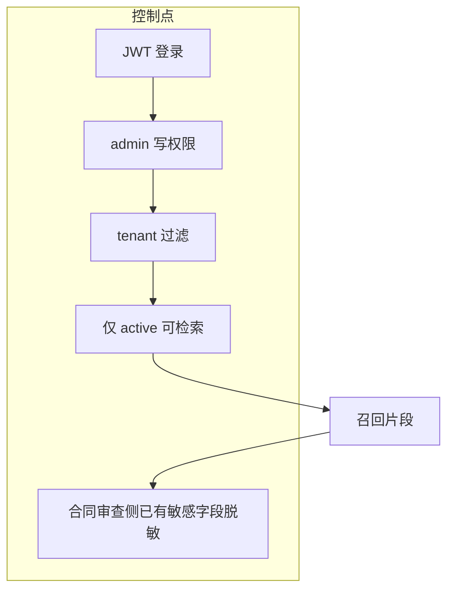

建议与现状：

| 项 | 建议 | 现状 |
|---|---|---|
| 知识库原文访问 | 仅 admin | 已限制管理 API |
| 审计 | 上传/删除/重索引写 audit_log | 可后续补 |
| 数据出域 | Embedding/LLM 走企业网关 | 取决于部署 `.env` |
| 通用规则误删 | 二次确认 | 前端已有 confirm，可加强文案 |

---

## 12. 非功能需求

| 指标 | 目标（PRD/TD） | 设计对应 |
|---|---|---|
| RAG 问答 P95 | ≤ 3s | Top-K 小、批量 embed、后续加缓存 |
| 合同审查 | ≤ 15s（含 LLM） | 规则召回并行于正文准备；失败降级 |
| 可用性 | 索引失败可重试 | `failed` + reindex |
| 可观测 | 记录注入 chunk 数、耗时 | 已有基础日志，可加 metrics |

性能演进杠杆：

1. 查询 embedding 短缓存（相同问题）；
2. ivfflat / HNSW 参数调优；
3. 异步索引；
4. Rerank 独立超时与降级。

---

## 13. 当前实现对照表

| 能力 | 设计 | 代码现状 |
|---|---|---|
| 文档列表/上传/删除/重索引 | 要有 | ✅ `kb.py` + `kb_service.py` |
| 切分 + Embedding | 要有 | ✅ `recursive_split` + `embed_batch` |
| **Milvus 向量主存** | 企业级必选 | ✅ `milvus_service` + Compose |
| 向量检索 + 关键词补充 | 要有 | ✅ Milvus ANN + PG ILIKE |
| PG embedding 可空 | 职责分离 | ✅ migration `007` |
| 管理端 UI | 要有 | ✅ `KnowledgeBase.tsx` |
| 检索测试 | 要有 | ✅ `/kb/test-retrieve` |
| 合同审查注入规则 | 要有 | ✅ `chat_service` 调用 `retrieve_rules` |
| 种子文档 | 要有 | ✅ 有正文；需管理员点「重新索引」 |
| Rerank | 完整检索需要 | ❌ 未做 |
| 制度问答主链路 | PRD 旅程二 | ✅ Chat 文本路径：RAG 召回 → `policy_query` 注入来源 |
| 异步索引 | 大文件需要 | ❌ 未做 |
| 会话历史 RAG | PRD 第四层 | ❌ 仅表结构预留；未来也可进 Milvus 另一 collection |
| 启停文档（不停用删除） | 管理端规划 | ⚠️ 可用 status，UI 未做启停开关 |

---

## 14. 部署与配置

### 14.1 必要配置

```env
EMBEDDING_MODEL=qwen3.7-text-embedding
EMBEDDING_API_KEY=...
EMBEDDING_BASE_URL=https://dashscope.aliyuncs.com/compatible-mode/v1
EMBEDDING_DIMENSION=1024

MILVUS_ENABLED=true
MILVUS_HOST=127.0.0.1          # Compose 容器内用 milvus；VM 开发用虚拟机 IP
MILVUS_PORT=19530
MILVUS_COLLECTION=finance_kb_chunks
MILVUS_INDEX_TYPE=IVF_FLAT
MILVUS_METRIC_TYPE=COSINE
KB_STORE_PG_EMBEDDING=false    # 需要 pgvector 降级时再开
```

未配 `EMBEDDING_API_KEY` 时，实现会回落 `LLM_*_API_KEY`，再回落管理端已启用的 `llm_configs` 密钥（同租户）。

### 14.2 基础设施

| Compose 文件 | Milvus 相关服务 |
|---|---|
| `docker-compose.yml` | `milvus` + `milvus-etcd` + `milvus-minio`，backend `depends_on` |
| `docker-compose.infra.yml` | 同上，端口 `19530` 暴露给 Windows 本机后端 |

### 14.3 上线检查清单

1. Milvus `19530` 可连通，`/healthz`（9091）健康；
2. `alembic upgrade head`（含 `007` embedding 可空）；
3. `pip install pymilvus`（或重建后端镜像）；
4. Embedding 连通；对「通用合规规则」点重索引；
5. 检索测试能召回；日志可见 `milvus inserted/ready`；
6. 合同审查日志出现 `contract review injected N rule chunks`。

---

## 15. 风险与缓解

| 风险 | 影响 | 缓解 |
|---|---|---|
| 召回不准 | 审查/问答答非所问 | 混合检索、Rerank、管理端检索测试、用户反馈 |
| 未索引却显示「可审查」 | 误以为已按制度审查 | 状态展示；审查区分规则命中；引导重索引 |
| Embedding 维数变更 | 全库失效 | 记录 embedding_model；迁移脚本 + 全量 reindex |
| 通用规则被误删 | 全平台回归 | 删除二次确认；操作审计 |
| Prompt 注入（恶意文档） | 操控模型行为 | 限制上传角色；可选净化；系统提示优先级 |
| 大文件同步超时 | 上传失败 | 文件大小限制；升级异步索引 |

---

## 16. 演进路线图

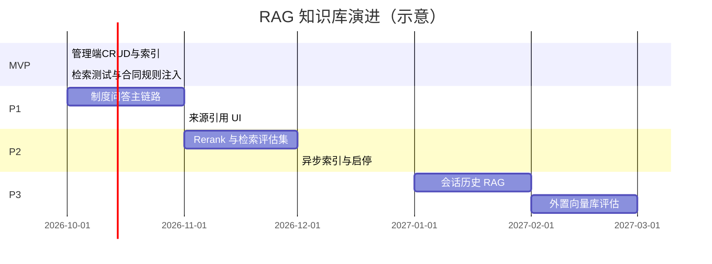

### P1 建议交付物

1. Chat 意图 `policy_query` → `retrieve` → LLM，回答附 `title + 片段`；
2. 无召回时的标准话术；
3. 简单线上指标：召回为空率、平均 score。

### P2 建议交付物

1. bge-reranker 或网关 Rerank；
2. 20～50 条制度问答评测集（问题 / 期望文档）；
3. Celery 索引任务 + 前端进度。

---

## 17. 目录与代码地图

| 路径 | 说明 |
|---|---|
| `backend/app/api/v1/kb.py` | HTTP API |
| `backend/app/services/kb_service.py` | 解析、切分、索引编排（双写协调） |
| `backend/app/services/rag_service.py` | Embedding、Milvus 检索 + PG 回表 |
| `backend/app/services/milvus_service.py` | Collection 管理、insert/delete/search |
| `backend/app/services/chat_service.py` | 合同审查注入规则 |
| `backend/app/models/__init__.py` | `KbDocument` / `KbChunk` |
| `backend/alembic/versions/007_*.py` | embedding 可空 |
| `docker-compose.yml` / `docker-compose.infra.yml` | Milvus Standalone |
| `backend/scripts/seed.py` | 通用合规规则、差旅补贴种子 |
| `frontend/src/components/admin/KnowledgeBase.tsx` | 管理端 UI |
| `frontend/src/api/admin.ts` | `kbApi` |

---

## 18. 总结

本设计把知识库定位为平台的 **可维护组织记忆层**，并按企业级 Agent 标准拆分存储：

- **Postgres**：文档生命周期、切片正文、关键词、租户权限；
- **Milvus**：专业向量 ANN（主路径），按 `tenant_id` / `doc_type` 过滤；
- **索引**：解析 → 切分 → Embedding → PG 正文 + Milvus 向量；
- **检索**：Milvus 召回 → 回表正文 → 关键词补充 → 注入 LLM；
- **原则**：规则不进代码、通用与租户分层、向量与 OLTP 解耦、RAG 失败可降级。

一句话：**企业级 Agent 用 Milvus 扛向量检索，用 Postgres 扛业务真相，同一套文档管道服务制度问答与合同合规规则。**
